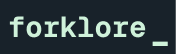

<div align="center" markdown="1">
    
    <h1>Forklore</h1>

**Website for forklore, built on Nuxt**

</div>

## About Forklore

Forklore is a data driven Open-Source website consisting of stories of maintainers from all over India.

### Planet

- [Planet Forklore](https://forkore.in/planet "Planet Forklore") is introduced as on [2026-03-27 Fri] to aggregate all maintainers blog posts into a [Planet](https://en.wikipedia.org/wiki/Comparison_of_feed_aggregators "Planet Feed Aggregator")
- If you are a maintainer and would like to be part of it, then please submit "RSS" field in the Issue template to get featured.

Implementation is based on [Planet Ubuntu's Terra](https://github.com/Ubuntu-Community-Team/terra/)

## Social media campaign

Everyone featured on Forklore was already or will be highlighted via the FOSS United Social media handles.

Our Primary place of showcasing/connecting maintainers is our Forum: [#MeetTheMaintainers](https://forum.fossunited.org/t/introducing-forklore-in/5836)

| [Mastodon](https://mas.to/@fossunited) | [Bluesky](https://bsky.app/profile/fossunited.mas.to.ap.brid.gy) | [LinkedIn](https://www.linkedin.com/company/fossunited/) | [Instagram](https://www.instagram.com/fossunited/) | [X/Twitter](https://x.com/fossunited) |
|:---------------------------------------|:-----------------------------------------------------------------|:---------------------------------------------------------|:---------------------------------------------------|:--------------------------------------|

## Contribute

See something you can fix or make better? In the true spirit of Open-Source, we welcome all contributions from our community.

Looking to get featured? Refer to [this document](/GET_FEATURED.md).

### Prerequisites

```
- node 20+
- yarn 1.22.22+
```

### Local Setup

To get started with local development, follow these steps:

- Clone this repository
- Open this directory in terminal, and run `yarn install`
- Start development server by running `yarn run dev`
- The website should start running in `http://localhost:3000`
